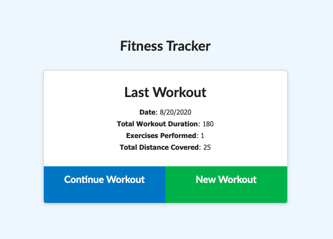

  # Fitness Tracker
  
  
  
  ## Table of Contents
  1. [Project Description](#description)
  2. [Installation](#install)
  3. [Usage](#usage)
  4. [License](#license)
  5. [Contributors](#contributors)

  
  ## Project Description
  Users view create and track daily workouts, log multiple exercises in a workout on a given day, track the name, type, weight, sets, reps, and duration of exercise.
  

  ## Installation
  Install Morgan, Mongoose, Express, and Dotenv (npm install).
  

  ## Usage
  After installing Morgan, Mongoose, Express, and Dotenv, type in "npm run seed" in the terminal to run the seed.  After running the seed, start the server by typing in "npm rnu watch".  In your browser, go to localhost:3000 to view the app.

  Or, just go to the following link and it will run! 
  https://workout-tracker-jmj.herokuapp.com/
  

  ### License
  MIT
  

  ### Contributors
  Jonayah M. Jackson
  James Kim
  Camrynne Sullivan
  Justin Ramirez
  Melissa Mercado

  #### Screenshots
  
  

  #### Contact Me
  * Heroku App: https://workout-tracker-jmj.herokuapp.com/
  * GitHub Profile: https://github.com/JonayahJ
  * Email Address: jonayah@thinkhalcyon.com
